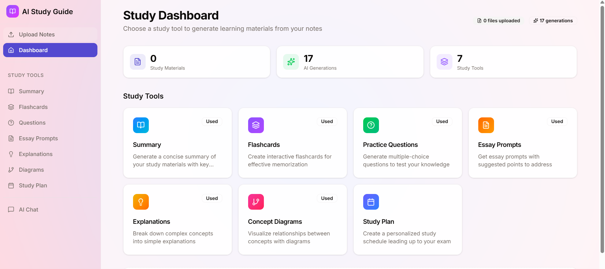
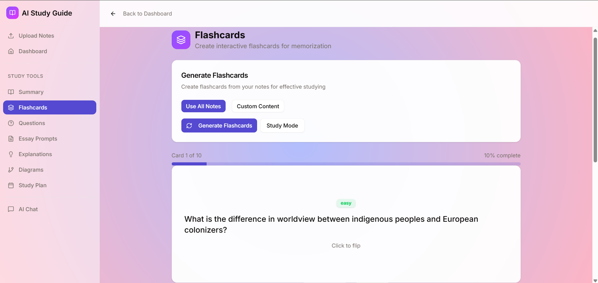
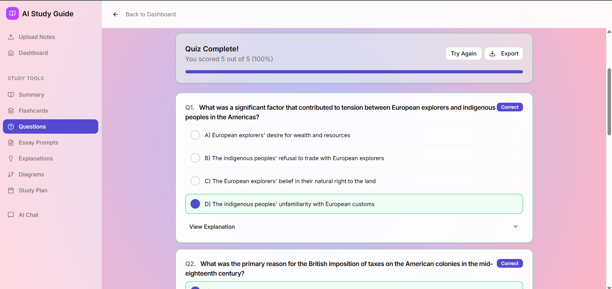
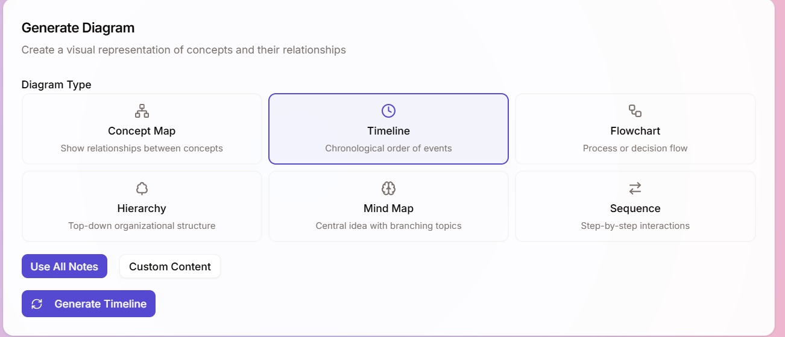
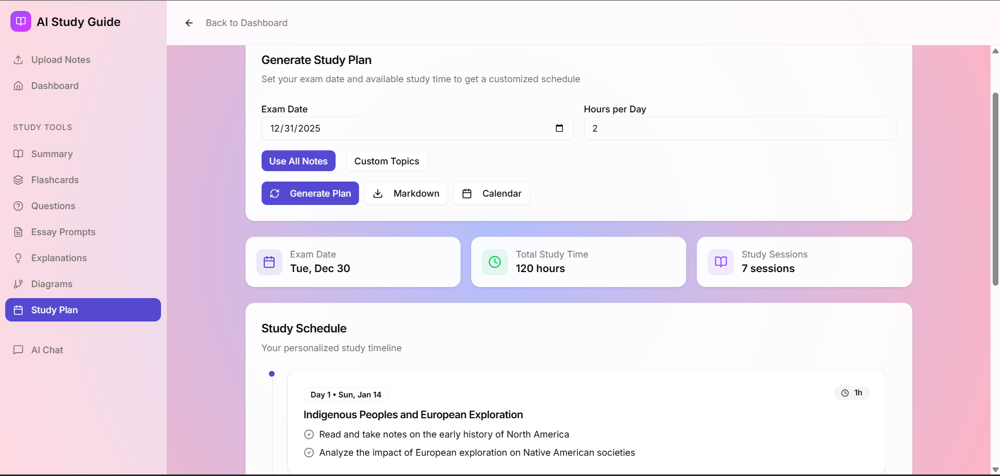
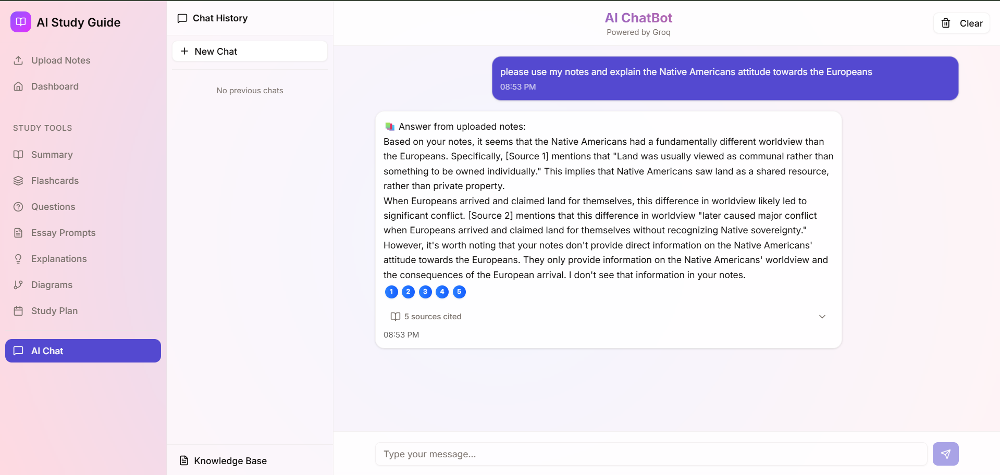

# 🎓 StudyBot AI

### Intelligent Study Assistant with RAG-Powered Document Analysis

[](https://openjdk.org/)
[](https://spring.io/projects/spring-boot)
[](https://vuejs.org/)
[](https://www.typescriptlang.org/)
[](https://groq.com/)
[](LICENSE)

<p align="center">
  
</p>

> **Transform your study materials into interactive learning experiences.** Upload documents, ask questions, and generate flashcards, summaries, and study plans—all powered by AI.

---

## 📸 Screenshots

<details>
<summary><b>🎯 Study Dashboard</b> — All 7 tools at a glance</summary>
<p align="center">
  
</p>
</details>

<details>
<summary><b>📝 AI-Generated Flashcards</b> — With difficulty ratings</summary>
<p align="center">
  
</p>
</details>

<details>
<summary><b>✅ Practice Quizzes</b> — Multiple choice with explanations</summary>
<p align="center">
  
</p>
</details>

<details>
<summary><b>📊 Concept Diagrams</b> — 6 diagram types to choose from</summary>
<p align="center">
  
</p>
</details>

<details>
<summary><b>📅 Study Plan</b> — Personalized schedule based on exam date</summary>
<p align="center">
  
</p>
</details>

<details>
<summary><b>📝 Essay Prompts</b> — Beginner to advanced difficulty</summary>
<p align="center">
  
</p>
</details>

<details>
<summary><b>💬 AI Chat</b> — RAG-powered Q&A with your documents</summary>
<p align="center">
  
</p>
</details>

---

## 🌟 Why StudyBot?

| Problem | Solution |
|---------|----------|
| 📚 Hours spent manually creating flashcards | ⚡ AI generates flashcards in seconds |
| 🤯 Struggling to summarize dense materials | 📝 Instant multi-level summaries |
| ❓ No one to answer questions at 2am | 🤖 24/7 AI tutor with document context |
| 📅 Disorganized study schedule | 📆 Personalized study plans by exam date |

---

## ✨ Features

<table>
<tr>
<td width="50%">

### 🤖 RAG-Powered Chat
- **Context-aware responses** from your uploaded documents
- **Citation tracking** to verify AI answers
- **Multi-turn conversations** with memory
- **Vector similarity search** for relevant context

</td>
<td width="50%">

### 📚 7 AI Study Tools
- **Summaries** — Key points extraction
- **Flashcards** — Q&A with difficulty ratings  
- **Practice Questions** — Multiple choice + explanations
- **Essay Prompts** — Topics with grading rubrics
- **Diagrams** — 6 types of Mermaid.js visuals
- **Study Plans** — Exam-date based scheduling
- **Explanations** — Simplified concepts

</td>
</tr>
<tr>
<td width="50%">

### 📄 Smart Document Processing
- **Multi-format**: PDF, DOCX, TXT, Markdown
- **Async processing** with progress tracking
- **Intelligent chunking** for optimal retrieval
- **Duplicate detection** via SHA-256 hashing

</td>
<td width="50%">

### ⚡ Developer Experience
- **Hot reload** for frontend and backend
- **One-command startup** with PowerShell scripts
- **Comprehensive API** with REST endpoints
- **Type-safe** TypeScript + Java

</td>
</tr>
</table>

---

## 🏗️ Architecture

```
┌────────────────────────────────────────────────────────────────┐
│                         FRONTEND                                │
│  ┌─────────────┐  ┌─────────────┐  ┌─────────────────────────┐ │
│  │  Chat View  │  │Study Tools  │  │   Document Manager      │ │
│  │  (RAG Q&A)  │  │ (7 Tools)   │  │   (Upload/Process)      │ │
│  └──────┬──────┘  └──────┬──────┘  └────────────┬────────────┘ │
│         └────────────────┴──────────────────────┘              │
│                Vue 3 • TypeScript • Pinia • TailwindCSS         │
└────────────────────────────────┬───────────────────────────────┘
                                 │ REST API
┌────────────────────────────────┴───────────────────────────────┐
│                         BACKEND                                 │
│  ┌──────────────────────────────────────────────────────────┐  │
│  │                   REST Controllers                        │  │
│  │   ChatController • StudyController • DocumentController   │  │
│  └──────────────────────────────────────────────────────────┘  │
│  ┌──────────────────────────────────────────────────────────┐  │
│  │                   Service Layer                           │  │
│  │  ChatService   StudyService   DocumentService   RAGService│  │
│  │       │             │               │               │      │  │
│  │       └─────────────┴───────────────┴───────────────┘      │  │
│  │                          │                                 │  │
│  │              ┌───────────┴───────────┐                     │  │
│  │              │   EmbeddingService    │                     │  │
│  │              │  (384-dim vectors)    │                     │  │
│  │              └───────────────────────┘                     │  │
│  └──────────────────────────────────────────────────────────┘  │
│                Spring Boot 3.5 • Java 17 • JPA                  │
└────────────────────────────────┬───────────────────────────────┘
                                 │
        ┌────────────────────────┼────────────────────────┐
        ▼                        ▼                        ▼
┌───────────────┐      ┌─────────────────┐      ┌─────────────────┐
│   Groq API    │      │   PostgreSQL    │      │  File Storage   │
│  LLaMA 3.1-8B │      │    + pgvector   │      │    ./uploads    │
│  (Inference)  │      │   (Embeddings)  │      │   (Documents)   │
└───────────────┘      └─────────────────┘      └─────────────────┘
```

---

## 🛠️ Tech Stack

<table>
<tr>
<td align="center" width="96">

<br>Java 17
</td>
<td align="center" width="96">

<br>Spring Boot
</td>
<td align="center" width="96">

<br>PostgreSQL
</td>
<td align="center" width="96">

<br>Vue 3
</td>
<td align="center" width="96">

<br>TypeScript
</td>
<td align="center" width="96">

<br>Tailwind
</td>
<td align="center" width="96">

<br>Vite
</td>
<td align="center" width="96">

<br>Docker
</td>
</tr>
</table>

**Backend:** Spring Boot 3.5 • Spring Data JPA • Hibernate • Maven • Apache POI • PDFBox  
**Frontend:** Vue 3 Composition API • Pinia • Vue Router • shadcn-vue • Mermaid.js  
**AI/ML:** Groq API (LLaMA 3.1-8B) • Local Embeddings (384-dim) • RAG Pipeline

---

## 🚀 Quick Start

### Prerequisites

| Requirement | Version |
|-------------|---------|
| Java | 17+ |
| Node.js | 18+ |
| Maven | 3.6+ |
| Groq API Key | [Get free key](https://console.groq.com/) |

### 1️⃣ Clone & Configure

```bash
git clone https://github.com/dsokol3/ChatBot.git
cd ChatBot
```

Create `.env` file in the root directory:
```env
LLM_API_URL=https://api.groq.com/openai/v1
LLM_API_KEY=your-groq-api-key-here
LLM_MODEL=llama-3.1-8b-instant
```

### 2️⃣ Start the Application

**Option A: One-Command Start (Recommended)**
```powershell
.\start-dev.ps1
```
> Opens backend (port 8080) + frontend (port 5173) in separate terminals

**Option B: Backend Only**
```powershell
.\start-backend.ps1
```

**Option C: Manual Start**
```bash
# Terminal 1 - Backend
mvn spring-boot:run -Dspring-boot.run.profiles=dev

# Terminal 2 - Frontend
cd frontend && npm install && npm run dev
```

### 3️⃣ Open in Browser

| Service | URL |
|---------|-----|
| 🌐 Frontend | http://localhost:5173 |
| 🔌 Backend API | http://localhost:8080/api |

---

## 📡 API Reference

<details>
<summary><b>💬 Chat Endpoints</b></summary>

#### Send Message
```http
POST /api/chat/message
Content-Type: application/json

{
  "message": "Explain the key concepts from my notes",
  "conversationId": "user-123"
}
```

#### Get Conversation History
```http
GET /api/chat/history/{conversationId}
```
</details>

<details>
<summary><b>📄 Document Endpoints</b></summary>

#### Upload Document
```http
POST /api/documents/upload
Content-Type: multipart/form-data

file: <binary>
conversationId: "user-123"
```

#### List Documents
```http
GET /api/documents/conversation/{conversationId}
```
</details>

<details>
<summary><b>📚 Study Tools Endpoints</b></summary>

#### Generate Summary
```http
POST /api/study/generate/summary
{ "content": "Text to summarize..." }
```

#### Generate Flashcards
```http
POST /api/study/generate/flashcards
{ "content": "Study material...", "count": 10 }
```

#### Generate Practice Questions
```http
POST /api/study/generate/questions
{ "content": "Study material...", "count": 5 }
```

#### Generate Diagram
```http
POST /api/study/generate/diagram
{ "content": "Concepts...", "diagramType": "flowchart" }
```
> Diagram types: `concept-map`, `timeline`, `flowchart`, `hierarchy`, `mind-map`, `sequence`

#### Generate Study Plan
```http
POST /api/study/generate/study-plan
{ "content": "Topics...", "examDate": "2025-01-15", "hoursPerDay": 2 }
```
</details>

---

## 📁 Project Structure

```
ChatBot/
├── 📂 src/main/java/com/chatbot/
│   ├── 📂 controller/     # REST API endpoints
│   ├── 📂 service/        # Business logic + AI integration
│   ├── 📂 repository/     # Data access layer
│   ├── 📂 entity/         # JPA entities
│   └── 📂 config/         # Spring configuration
├── 📂 frontend/
│   ├── 📂 src/
│   │   ├── 📂 views/      # Page components
│   │   ├── 📂 components/ # Reusable UI components
│   │   ├── 📂 services/   # API client
│   │   ├── 📂 stores/     # Pinia state management
│   │   └── 📂 composables/# Vue composition functions
│   └── 📄 vite.config.ts
├── 📄 start-dev.ps1       # Start both services
├── 📄 start-backend.ps1   # Start backend only
├── 📄 docker-compose.yml  # Container orchestration
└── 📄 pom.xml             # Maven configuration
```

---

## 🐳 Docker Deployment

```bash
# Start all services
docker-compose up -d

# View logs
docker-compose logs -f

# Stop services
docker-compose down
```

---

## 🔮 Roadmap

- [ ] 🔐 User authentication & personal workspaces
- [ ] 📊 Study analytics dashboard
- [ ] 🎯 Spaced repetition for flashcards
- [ ] 📱 Mobile-responsive design improvements
- [ ] 🌙 Dark mode
- [ ] 🔄 Real-time collaboration

---

## 🤝 Contributing

Contributions are welcome! Please feel free to submit a Pull Request.

1. Fork the repository
2. Create your feature branch (`git checkout -b feature/AmazingFeature`)
3. Commit your changes (`git commit -m 'Add some AmazingFeature'`)
4. Push to the branch (`git push origin feature/AmazingFeature`)
5. Open a Pull Request

---

## 📄 License

This project is licensed under the MIT License - see the [LICENSE](LICENSE) file for details.

---

## 👤 Author

### **Devora Sokol**

[](https://github.com/dsokol3)
[](https://linkedin.com/in/devorasokol)

---

<p align="center">
  <b>If this project helped you, please consider giving it a ⭐!</b>
</p>
